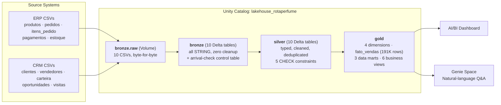
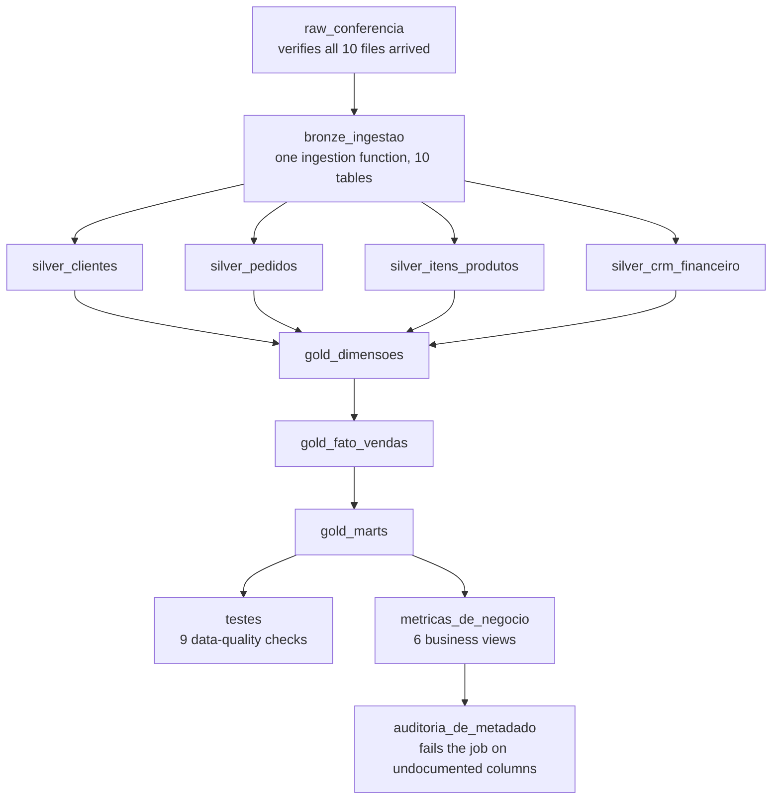

# Rota do Perfume — Lakehouse Analytics Platform

A production-style **Databricks Lakehouse** built end-to-end for *Rotaperfume*, a fictional B2B distributor of Arabian perfumery selling into retail (perfumeries, pharmacies, department stores, kiosks, independent resellers, beauty salons, e-commerce).

The project takes ~313K rows of raw ERP/CRM data and turns them into a governed, tested, documented analytics platform — with an AI/BI dashboard and a natural-language (Genie) assistant sitting on top — using **Databricks Asset Bundles** so the entire catalog, pipeline, dashboard, and AI agent are defined as code and deployed with a single command.

> This repository's active project lives in [`Projetos/LakehousePerfumes`](Projetos/LakehousePerfumes).

---

## What this project demonstrates

- **Infrastructure as code**: the whole Unity Catalog object graph (catalog, schemas, volumes, tables, views), the orchestration job, the BI dashboard, and the Genie AI agent are all version-controlled JSON/YAML/SQL, deployed via `databricks bundle deploy`.
- **The medallion architecture, done properly**: raw files are never touched; bronze preserves source data byte-for-byte as strings; silver is where cleaning, typing, and deduplication happen — with the business rules enforced as **Delta CHECK constraints**, not just code comments; gold is modeled for consumption (star schema + purpose-built business views), never raw.
- **Data quality as a first-class citizen**: 9 automated data tests and a metadata-completeness audit run as part of every pipeline execution and **fail the job** if a number stops reconciling or a column loses its documentation — not a report nobody reads.
- **AI-ready data**: the reason a natural-language agent (Genie) can answer real business questions accurately is that the data underneath it is clean, typed, documented, and modeled — not because the model got smarter.

## Architecture



### Pipeline orchestration

A single Lakeflow Job (`rotaperfume_pipeline`) runs all 12 tasks end-to-end, serverless, on a daily schedule:



Silver tables run in parallel (independent transformations); gold builds sequentially since each layer depends on the previous one; the final two branches — data-quality tests and the metadata audit — are the pipeline's last line of defense and **halt the job** on failure rather than let bad data reach the dashboard or the AI agent.

## Tech stack

| Layer | Technology |
|---|---|
| Compute & storage | Databricks (fully serverless), Delta Lake |
| Governance | Unity Catalog (catalogs, schemas, managed volumes, managed tables, CHECK constraints) |
| Orchestration | Lakeflow Jobs (formerly Databricks Workflows) |
| Transformations | PySpark notebooks (raw/bronze) + Spark SQL (silver/gold) |
| Infrastructure as code | Databricks Asset Bundles (DABs) — `databricks.yml` + `resources/*.yml` |
| BI | Databricks AI/BI Dashboards (Lakeview), defined as versioned JSON |
| AI / natural language | Databricks Genie Space, defined as versioned JSON with deterministic example-query IDs |
| CLI / tooling | Databricks CLI, driven by Claude Code with the Databricks AI Tools skill set |

## Repository structure

```
Projetos/LakehousePerfumes/
├── dados/                          # Source CSVs (ERP + CRM), ~313K rows total
│   ├── erp/                        # produtos, pedidos, itens_pedido, pagamentos, estoque
│   └── crm/                        # clientes, vendedores, carteira, oportunidades, visitas
├── .llm/                           # The 6 design prompts this project was built from
└── aulas/aula-02-engenharia-de-dados/rotaperfume/   # The Databricks Asset Bundle
    ├── databricks.yml              # Bundle definition, targets (dev/prod), variables
    ├── scripts/                    # Catalog bootstrap + raw file upload helpers
    ├── resources/                  # Bundle resources: job, dashboard, Genie space
    │   ├── catalogo.yml            #   Unity Catalog schemas + volume
    │   ├── pipeline.job.yml        #   The 12-task orchestration job
    │   ├── dashboard.dashboard.yml #   AI/BI dashboard resource
    │   ├── *.lvdash.json           #   (referenced) dashboard definition
    │   ├── genie.genie_space.yml   #   Genie space resource
    │   └── comercial.geniespace.json #  Genie space definition
    ├── src/
    │   ├── raw/                    # Arrival-check notebook
    │   ├── bronze/                 # Single-function ingestion notebook (10 tables)
    │   ├── silver/                 # Cleaning + typing + constraints (4 SQL scripts)
    │   ├── gold/                   # Dimensions, fact table, marts, business views, tests
    │   └── dashboards/             # Dashboard JSON source
    └── docs/                       # Genie instructions (business glossary, seasonality rules)
```

## Data quality & governance

- **Silver-layer contracts**: CNPJ normalized to 14 digits (never cast to a number), dates parsed defensively (`try_to_date`, never `to_date`, because ANSI mode aborts on malformed input instead of returning `NULL`), duplicate customer records merged with full audit trail, returns and cancellations *flagged, never dropped*.
- **5 Delta CHECK constraints** enforced at the table level (e.g. `pedido_cancelado_zerado: NOT cancelado OR valor_liquido = 0`) — a constraint that rejects a bad write is a rule the *table* enforces, independent of whatever script runs against it.
- **9 automated tests** on every pipeline run, including the one that matters most: gold revenue must equal silver revenue to the cent (**R$ 102,303,828.05**) — a cleanup pass is only correct if it doesn't change the top-line number.
- **100% metadata coverage** on the gold layer, audited on every run: every table, view, and business-critical column must carry a `COMMENT` describing its business meaning — because that's exactly what the Genie agent reads to decide which column to use.

## Business layer

Six views, named the way a business stakeholder would ask for them (not `mart_produto_performance` — `ranking_marcas`, `clientes_em_risco`, `margem_por_categoria`...), each documented with the *question* it answers rather than its technical shape:

| View | Answers |
|---|---|
| `receita_mensal` | How did revenue and margin trend month over month, and which months are seasonal peaks? |
| `ranking_marcas` | Which brands sell the most, at what margin, and what share of revenue? |
| `margem_por_categoria` | Which category actually makes money — the highest-revenue one isn't always the most profitable |
| `clientes_em_risco` | Which customers have gone quiet (90+ days), and how much monthly revenue is at stake? |
| `efeito_lancamento` | Do new product launches really outsell their post-launch baseline? |
| `ruptura_por_marca` | Which brands run out of stock most often? |

## Getting started

```bash
cd Projetos/LakehousePerfumes/aulas/aula-02-engenharia-de-dados/rotaperfume

databricks bundle validate --target dev --profile <your-profile>
databricks bundle deploy   --target dev --profile <your-profile>
databricks bundle run rotaperfume_pipeline --target dev --profile <your-profile>
```

Requires the [Databricks CLI](https://docs.databricks.com/dev-tools/cli/install.html) and a workspace with Unity Catalog and a SQL warehouse.

## Project origin

This platform was built iteratively across six self-contained design prompts (preserved in [`.llm/`](Projetos/LakehousePerfumes/.llm)), each one a complete deployable increment: raw ingestion → bronze → silver with data contracts → gold modeling and testing → BI dashboard → natural-language AI layer. Every increment was deployed and numerically verified against the source data before moving to the next.
